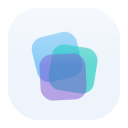

<div align="center">



# Tessera

一款简洁卡片式的 Hexo 主题

<p>纯净底色上的简洁描边卡片，叠一层轻微磨砂质感；搭配 Canvas 漂浮玻璃碎片的背景签名与单色蓝强调。</p>


**[📖 在线文档](https://hexo-theme-tessera.vercel.app)**

</div>

---

## ✨ 这是什么

**Tessera** 是一款现代化的 Hexo 主题，设计风格**简洁克制**：在纯净的浅 / 深底色上排布近乎实色的**描边卡片**，仅叠一层轻微磨砂质感，让 Canvas 漂浮玻璃碎片的背景隐约透出而不喧宾夺主；顶部是一条全宽贴顶的磨砂玻璃导航栏（菜单项为胶囊样式），全站只用一个蓝色作为强调。它从 [Butterfly](https://github.com/jerryc127/hexo-theme-butterfly) 重构而来，保留了丰富的功能生态，并在视觉与交互上做了彻底的重新设计，以 **AGPL-3.0** 重新授权。

## 🎨 主题特色

### 视觉与交互
- **简洁卡片式设计** — 纯净底色 + 近实色描边卡片 + 轻微磨砂质感，单一蓝色强调，克制而统一
- **磨砂玻璃顶栏** — 全宽贴顶导航栏，菜单 / 搜索为胶囊药丸样式，悬停呈现磨砂折射高光
- **标题滚动切换** — 下滑时博客标题与文章标题垂直滚动过渡，悬停反向显示「返回首页」
- **Tessera 玻璃碎片背景** — 基于 Canvas 2D 的漂浮玻璃碎片场（零依赖、限帧省电），支持鼠标视差、滚动漂移、深浅色自适应（主题视觉签名）
- **深色模式** — 跟随系统 / 定时 / 手动切换，全站配色随之翻转
- **首页开屏模块** — 标语卡 + 双行反向滚动图标墙 + 分类入口 + 推荐位
- **自定义右键菜单** — 导航 / 复制 / 随机文章 / 昼夜切换，并支持选中文字、链接、图片的情境动作
- **圆角 / 直角** 可切换，**响应式** 适配各种屏幕

### 内容与页面
- **多种首页布局** — 7 种文章卡片排布（含瀑布流）
- **随机封面** — 未设封面的文章自动从指定目录随机取图
- **特色页面** — 关于页（开放式个人主页）、友链页、说说页、标签 / 分类墙
- **文章增强** — 双端目录（TOC）、相关文章、过期提醒、字数统计 / 阅读时长、版权声明、打赏
- **系列文章** — 把多篇文章组织成系列
- **简繁转换** — 简体 / 繁体中文一键切换

### 标签插件（Markdown 增强）
note 提示框、tabs 选项卡、timeline 时间线、button 按钮、gallery 相册、折叠块、行内图片、文字高亮、mermaid 流程图、chartjs 图表、score 乐谱、series 系列、flink 友链卡片等。

### 搜索 · 评论 · 统计 · 特效
- **搜索** — Algolia / 本地搜索 / DocSearch
- **评论** — Disqus、Gitalk、Valine、Waline、Twikoo、Giscus、Artalk 等，支持同时启用两套
- **统计与分析** — 不蒜子、Google Analytics、百度统计、Cloudflare、Microsoft Clarity、Umami
- **数学公式** — MathJax / KaTeX
- **代码块** — 多套高亮主题、复制、语言标签、折叠、自动换行
- **特效** — 彩带 / Canvas Nest 背景、鼠标点击特效、Preloader 加载动画、图片灯箱、懒加载
- **进阶** — PWA、Pjax、Instant.page、音乐播放器（APlayer/Meting）、Snackbar 提示

## 🚀 快速开始

在 Hexo 博客根目录下克隆主题：

```bash
git clone https://github.com/LumiDesk/hexo-theme-tessera.git themes/tessera
```

启用主题（站点根目录 `_config.yml`）：

```yaml
theme: tessera
```

安装**必装**的渲染器依赖（装在博客根目录，而非主题目录）：

```bash
npm install hexo-renderer-pug hexo-renderer-stylus --save
```

> 💡 个性化配置请写在站点根目录的 `_config.tessera.yml` 中，避免直接改动主题目录，方便后续更新。

部分功能需要按需安装可选插件（如 `hexo-wordcount` 字数统计、`hexo-generator-searchdb` 本地搜索）。**完整的配置说明、可选插件、页面用法与标签插件语法，请查阅 👉 [使用文档](https://hexo-theme-tessera.vercel.app)。**

## 📖 文档

📖 **在线文档：<https://hexo-theme-tessera.vercel.app>**

完整使用文档（配置字段详解、页面进阶用法、标签插件、常见问题等）以 [VitePress](https://vitepress.dev/) 编写，源码位于仓库的 [`docs/`](./docs/) 目录。本地预览：

```bash
cd docs
pnpm install
pnpm docs:dev
```

## 📄 授权条款

本项目采用 [GNU Affero 通用公共许可证 v3.0（AGPL-3.0）](LICENSE)。

简而言之：你可以自由使用、修改与再发布本主题，但任何衍生作品——**包括以网络服务形式提供时**——都必须同样以 AGPL-3.0 开源发布。允许商业使用，但须遵守同样的开源义务。

## 🙏 致敬与感谢

Tessera 基于 Jerry（CrazyWong）的 [hexo-theme-butterfly](https://github.com/jerryc127/hexo-theme-butterfly) 重构开发，原项目采用 Apache License 2.0 授权；而 Butterfly 又是基于 [hexo-theme-melody](https://github.com/Molunerfinn/hexo-theme-melody) 开发。衷心感谢原作者们的精彩创作，为本主题提供了坚实的基础。

## 💬 获取帮助

- 🐛 发现问题 → [GitHub Issues](https://github.com/LumiDesk/hexo-theme-tessera/issues)
- 💡 有好想法 → [GitHub Discussions](https://github.com/LumiDesk/hexo-theme-tessera/discussions)

---

<div align="center">

**✨ 如果这个主题对你有帮助，欢迎点一个 ⭐ Star！✨**

</div>
